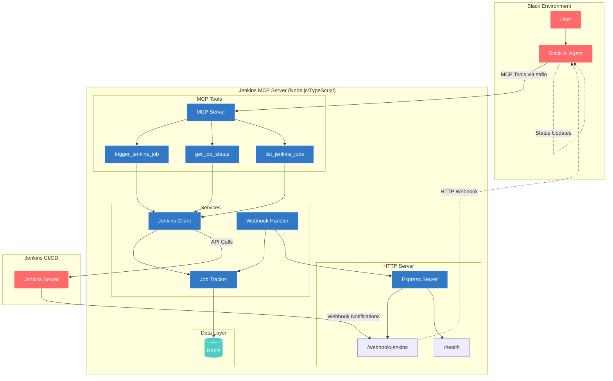
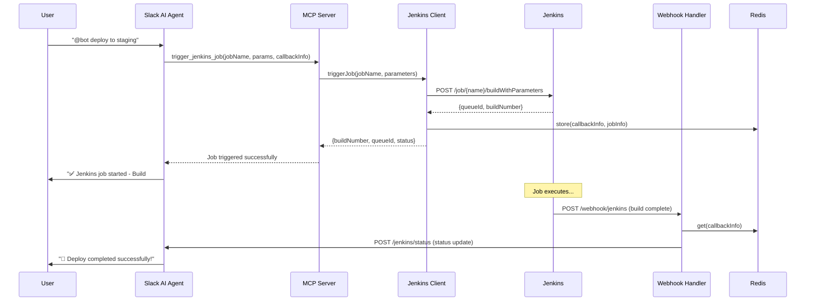
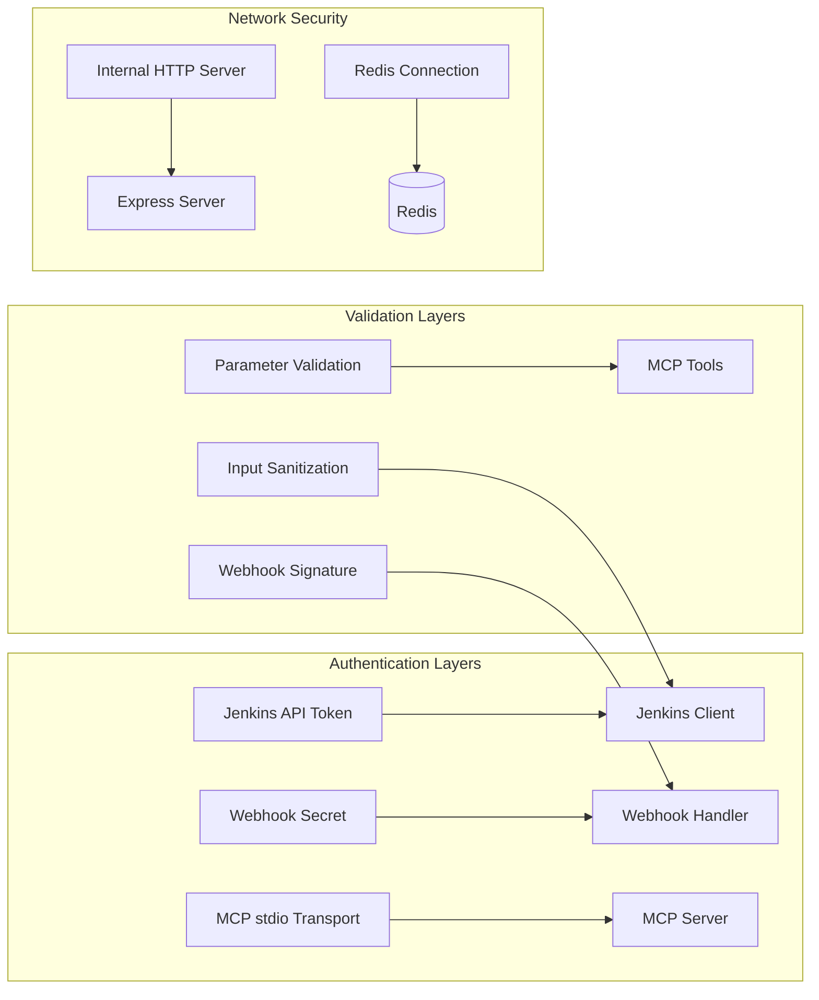

# Jenkins MCP Server - Architecture Diagram

## System Overview



## Component Architecture

### 1. MCP Server Layer (TypeScript)
```
┌─────────────────────────────────────────────────────────────┐
│                    MCP Server Service                       │
├─────────────────────────────────────────────────────────────┤
│  • Server initialization and tool registration             │
│  • Request routing to appropriate tools                     │
│  • Error handling and logging                              │
└─────────────────────────────────────────────────────────────┘
                              │
        ┌─────────────────────┼─────────────────────┐
        │                     │                     │
        ▼                     ▼                     ▼
┌─────────────────┐ ┌─────────────────┐ ┌─────────────────┐
│ trigger_jenkins │ │  get_job_status │ │ list_jenkins    │
│     _job        │ │                 │ │    _jobs        │
└─────────────────┘ └─────────────────┘ └─────────────────┘
```

### 2. Service Layer (TypeScript)
```
┌─────────────────────────────────────────────────────────────┐
│                   Jenkins Client Service                    │
├─────────────────────────────────────────────────────────────┤
│  • API authentication with Jenkins                         │
│  • Job triggering with parameters                          │
│  • Status queries and job information retrieval            │
│  • Error handling for Jenkins API calls                    │
└─────────────────────────────────────────────────────────────┘
                              │
                              ▼
┌─────────────────────────────────────────────────────────────┐
│                   Job Tracker Service                       │
├─────────────────────────────────────────────────────────────┤
│  • Store callback information in Redis                     │
│  • Track job execution state                               │
│  • Clean up completed job data                             │
│  • Manage job-to-Slack thread mapping                      │
└─────────────────────────────────────────────────────────────┘
```

### 3. Webhook Layer (TypeScript)
```
┌─────────────────────────────────────────────────────────────┐
│                 Webhook Handler Service                     │
├─────────────────────────────────────────────────────────────┤
│  • Receive Jenkins build completion notifications          │
│  • Parse and validate webhook payloads                     │
│  • Send status updates back to Slack AI Agent              │
│  • Handle webhook authentication                           │
└─────────────────────────────────────────────────────────────┘
                              │
                              ▼
┌─────────────────────────────────────────────────────────────┐
│                    Express HTTP Server                      │
├─────────────────────────────────────────────────────────────┤
│  POST /webhook/jenkins  - Jenkins notification endpoint    │
│  GET  /health          - Health check endpoint             │
└─────────────────────────────────────────────────────────────┘
```

## Data Flow Sequence



## Technology Stack Breakdown

### Implementation Stack
- **Runtime**: Node.js 20+
- **Framework**: Express.js for webhook server
- **MCP SDK**: @modelcontextprotocol/sdk
- **Jenkins Integration**: jenkins npm package + axios
- **Data Storage**: Redis for job tracking
- **Testing**: Jest + TypeScript
- **Logging**: Winston


## Configuration Management

```
Environment Variables
├── Jenkins Configuration
│   ├── JENKINS_URL
│   ├── JENKINS_USERNAME
│   ├── JENKINS_PASSWORD
│   └── JENKINS_API_TOKEN
├── MCP Server Configuration
│   ├── MCP_SERVER_NAME
│   └── MCP_SERVER_VERSION
├── Webhook Configuration
│   ├── WEBHOOK_PORT
│   └── WEBHOOK_SECRET
├── Redis Configuration
│   └── REDIS_URL
└── Slack Integration
    └── SLACK_WEBHOOK_URL
```

## Security Architecture



## Deployment Architecture

```
Docker Container
├── Node.js Runtime
├── Application Code (TypeScript compiled to JavaScript)
├── Dependencies (node_modules)
├── Configuration Files
└── Health Check Endpoint

External Dependencies
├── Jenkins Server (HTTP API)
├── Redis Server (Data Storage)
└── Slack AI Agent (Webhook Target)
```